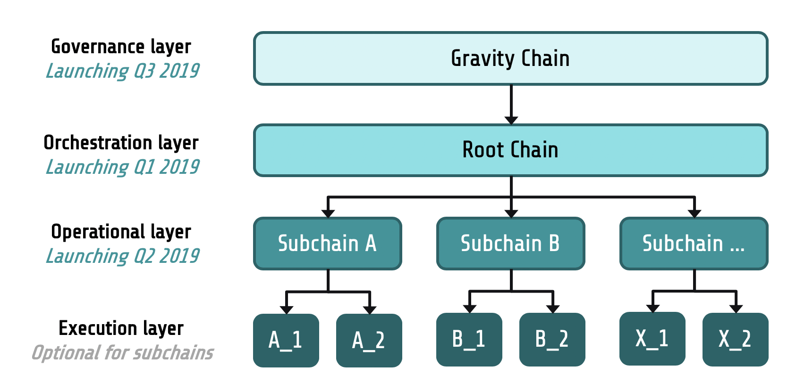
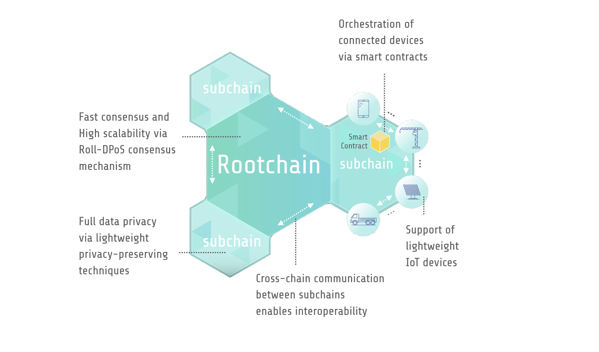

# gitbook-iotex-docs

## IoTeX 文档

## 简介

作为 2017 年成立开源项目，IoTeX 正在为物联网（IoT）构建世界领先的自动可扩展和以隐私为中心的区块链平台。我们的使命是为合作的时代构建去中心化的信任结构，包括设备间数据交换、应用程序和人员之间。我们内部正在开发多种创新技术，包括用于异构计算的区块链和区块链架构，快速且稳健的 Roll-DPoS 共识方案，以及高效的可信计算协议。更多细节可以在[这里](https://iotex.io/academics)找到。IoTeX 核心团队正在不断努力为社区带来更酷的功能。

### 宏观设计

IoTeX 网络的总体设计采用了分权思想，这是 Charles-Louis de Secondat 创造的一个术语，它指出民主政治权力应该分为立法，行政和司法权力。总的来说，IoTeX 网络是一种由多个区块链组成的去中心化的信任结构，用于连接人，机器，应用程序，不同的分层等级用于服务不同目的。




* 治理层，由重力链实例化的治理层是扮演 IoTeX 网络的去中心化政府。它专注于权力下放和安全，是一种以活跃度为导向的共识机制（例如，PoS variant），用以促进诸如权益质押、投票、罚没、与协议相关的提案等任务。在 2019 Q3 / Q4 重力链发布之前，以太坊主网将用作治理层。
* 业务流程层，由根链实例化而来，是所有子链的管理者和协调员。它由我们以安全为导向的 Roll-DPoS 共识机制提供支持，旨在实现合理的吞吐量，可靠性和透明度。它将于 2019年  4 月推出（Mainnet Alpha），作为 IoTeX 网络中的第一个区块链。
* 操作层，是各种 layer2 子链的实例化，操作层是处理与特定用例/应用程序相关的业务逻辑的具体单元。不同的子链可以通过跨链通信相互操作。第一个 IoTeX 子链预计将于 2019 年 Q2/Q3 推出，专注于可信计算。
* 执行层，是一个可选层，特定子链可以卸载具体的计算/存储任务到该层上。状态生成过程中的分离验证和订购状态对于提高去中心化系统的可扩展性，功能性和可用性非常有帮助。

在我们的设计中，所有区块链共享相同的投票资源池，以此产生共识是整个网络安全的保障，也是集体信任的基石。通过提供的集体信任，可以轻松地启动子链，就像在 AWS 云上启动 EC2 实例一样轻松。由于 EDR 的抽象化，在 IoTeX 网络中运行的子链具有截然不同的状态转换和执行层以及基础加密经济。

我们之所以将责任划划分给多个区块链层，是因为我们坚信去中心化的治理。许多 DPoS 区块链在核心操作层上管理区块链的治理任务（如 质押/投票） - IoTeX 认为治理层不应与同一链上的操作层在一起。例如，当选的代表作为既得利益集团，可以忽视区块生产过程中的质押或投票交易，以减少被取消选举的可能（即利益冲突）。还有，当选代表可以执行协议升级（未经其他用户同意升级其软件），这些升级可能会不利于整个生态的其他部分。

## 介绍

### 根链

根链将在2019年第一季度推出（又名 Mainnet Alpha），它由四层组成：

* 网络层支持 IoTex 节点之间的点对点通信，并为其他应用程序和用户提供区块链服务（通过[grpc](https://grpc.io/)）。
* 共识层使用去中心化分散随机算法（DKG + BLS）运行 Roll-DPoS 在区块生产者候选池（通过质押或投票）中选择活动块的生产者。
* 状态转换层由五个子协议组成，负责将区块链的状态从一个转换为另一个。
* 编程层实现了业务逻辑的状态转换。目前仅支持使用 Solidity 编写的以太坊虚拟机（EVM）智能合约。开发人员可以无缝地将现有的DAPP移植到它上面。




### 子协议和动作

IoTex 根链的状态转换层足够灵活，支持简易的插入任何子协议。

* 帐户子协议为在此区块链上的帐户的提供记账功能。
* 执行子协议管理智能合约的执行和前进/回退状态。
* 轮询子协议与以太坊上的质押/投票的合约同步（在重力链准备好之前由以太坊扮演），并指导在 IoTeX 根链上升级/降级的投票。
* 奖励子协议负责向合格的代表和候选人分发区块奖励和纪元奖励。
* Multichain子协议管理子链管理和交叉链通信，这是一项正在进行的工作。

在 IoTeX 网络中，事务（与区块链数据交互的原子操作单元）被称为“动作”，存在与所描述的五个子协议相对应的五种类型的动作。更多信息可以在[这里](https://github.com/iotexproject/iotex-core/blob/master/proto/types/action.proto)找到。

## 构建并运行

使用 IoTeX 软件包的最简单方法是以独立模式运行它以进行演示和测试。“独立”表示单个节点本身构成整个区块链，生成新块，验证块，并将块添加到区块链。这种简单模式允许用户使用单个计算机/节点快速启动和测试区块链，而无需太多硬件资源。

### **From the source**

1. 设置 golang 环境，例如，[在 Linux 上](https://medium.com/@RidhamTarpara/install-go-1-11-on-ubuntu-18-04-16-04-lts-8c098c503c5f)，[在 MacOS 上](https://medium.com/golang-learn/quick-go-setup-guide-on-mac-os-x-956b327222b8)
2. `git clone git@github.com:iotexproject/iotex-core.git`
3. `make run`

### 使用docker镜像

1. 通过 [https://docs.docker.com/install/](https://docs.docker.com/install/) 在本地主机上安装 docker。正确安装和启动 docker 后，下载 IoTeX docker 镜像：`docker pull iotex/iotex-core:latest`
2. 从 [iotex-core](https://github.com/iotexproject/iotex-core) 下载配置文件 [config\_delegate.yaml](https://github.com/iotexproject/iotex-core)。打开文件并根据独立节点的需要修改某些参数。例如，blockCreationInterval 指定生成下一个块所花费的时间（以秒为单位）。如果您希望以较慢的速度生成块，请将其更改为更大的值。
3. sudo docker run -d -p 30100:14004 --mount type=bind,source=$PWD/config\_delegate.yaml,target=/etc/iotex/config\_local\_delegate.yaml iotex/iotex-core:testnet iotex-server -config-path=/etc/iotex/config\_local\_delegate.yaml

## ioctl \(command-line interface\)

ioctl 是一个用于与 IoTeX 区块链交互的命令行界面。

```text
Usage:
  ioctl [command]

Available Commands:
  account     Deal with accounts of IoTeX blockchain
  action      Deal with actions of IoTeX blockchain
  xrc20       Operate XRC20 contracts
  bc          Deal with block chain of IoTeX blockchain
  help        Help about any command
  node        Deal with nodes of IoTeX blockchain
  version     Print the version number of ioctl

Flags:
  -h, --help   help for ioctl
```

### 安装发行版

```text
curl https://raw.githubusercontent.com/iotexproject/iotex-core/master/install-cli.sh | sh
```

### 安装最新版

```text
curl https://raw.githubusercontent.com/iotexproject/iotex-core/master/install-cli.sh | sh -s "unstable"
```

## 用法和示例

所有ioctl命令的示例文档。

## 配置

`Variables: [endpoint, wallet, explorer, defaultacc]`  
`Explorers: [iotexscan (default), iotxplorer, custom]`

### **设置配置**

`Usage: ioctl config set VARIABLE VALUE`

```text
➜  ioctl config set endpoint api.iotex.one:443
endpoint is set to api.iotex.one:443
```

### **获取配置**

`Usage: ioctl config get VARIABLE | all`

```text
➜  ioctl config get wallet
/Users/IoTeX/.config/ioctl/default
```

### 重置配置

`Usage: ioctl config reset`

```text
➜  ioctl config reset
Config reset to default values
```

## 账户

### 创建账户

`Usage: ioctl account create`

```text
➜  ioctl account create
{
  "accounts": [
    {
      "address": "io12ly97a3sk94ne06qjz2vv6clv3za7mk2z2sra9",
      "privateKey": "bb59a2a2c21242831906e0c8d188c642fdc1324d27ac4ae0d8cbea373b22147b",
      "publicKey": "040780ba149d24ee5418084ee193a6be8b3b7cf5329d160fc8902270b342c4fed4b646cdd5fdaf52932eecb957297a9bf6dbb24f7faa9287a27df6b5e83781c74b"
    }
  ]
}
```

```text
➜  ioctl account create -n 3
{
  "accounts": [
    {
      "address": "io1dcx2490vk2sg0f7ujv9d3gu67rpvyk5rjp854s",
      "privateKey": "a40ffd19150b4f3cbb1ca779862fc63b15d432c0be9bba81c56856d00e370b91",
      "publicKey": "04483333bf900b59a412c26a8cf287e122be5d2882d66263ce330a2c84e426fcf48dca4e189dbef15dc3511b049b7708c1e3a49e4904a6286ffcc6019bb27a4ca9"
    },
    {
      "address": "io19sypnkmj6agqqgusht07m35lvlhz4ruehetagk",
      "privateKey": "fd49783f8687379e3eb6e5778977044cc7e464dd16df8444b8643d3d636f7ebc",
      "publicKey": "04bcae59b817ec2924adef52088e9295bb040d1a34fe49e64b41ca56e2cbb3be115256975d2c1472b0a3b47bea720810de092ef4d209924ce09fa896b29588a90d"
    },
    {
      "address": "io1ehlhw6kedp5x8y04ddr7fl0cs68ns32hdxuvdl",
      "privateKey": "2c1bdc74c7ff03f08f2e2d3b65af9a54dc5addc42613670bd4bb1f0440cd9468",
      "publicKey": "04cd1ff13e20cbe83bc8759ce21404edc2a9b78c57f8d2ffc648f2213dfee98b61d9ebaffe03f32e7a13fbe319b1958c99ed701c3fa1046790f6af12f32262309b"
    }
  ]
}
```

### 在钱包中创建一个账户

`Usage: ioctl account createadd ALIAS`

```text
➜  ioctl account createadd IOsenser
#IOsenser: Set password
#IOsenser: Enter password again
New account "IOsenser" is created.
Please Keep your password, or your will lose your private key.
```

### **使用**私钥导入账户

`Usage: ioctl account import [key|keystore] ALIAS`

Two options are available.

If you use `key`,

```text
➜  ioctl account import key whale
#whale: Enter your private key, which will not be exposed on the screen.
#whale: Set password
#whale: Enter password again
New account #whale is created. Keep your password, or your will lose your private key.
```

If you use `keystore`,

```text
➜  ioctl account import keystore whale
```

### **从帐户导出私钥**

`Usage: ioctl account export (ALIAS|ADDRESS)`

```text
➜  ioctl account export whale
Enter password #whale:
xxxxxxxxxxxxxxxxxxxxxxxxxxxxxxxxxxxxxxxxxxxxxxxxxxxxxxxxxxxxxxxx
```

### **删除帐户**

`Usage: ioctl account delete (ALIAS|ADDRESS)`

```text
➜  ioctl account delete whale
** This is an irreversible action!
Once an account is deleted, all the assets under this account may be lost!
Type 'YES' to continue, quit for anything else.
yes
Enter password #io1t54nfdnpldaxkpm35f2gzh3rx6cakypmp5xfz5:
Account #io1t54nfdnpldaxkpm35f2gzh3rx6cakypmp5xfz5 has been deleted.
```

### **列出所有帐户**

`Usage: ioctl account list`

```text
➜  ioctl account list
io1r2r0um9dw35922tptkuphseq43hq2knk3fjrlt - IOsenser
io17laykjt9qgafuxj58fuspuxzlv6y4qgxf82vnm - frank
io1l3wc0smczyay8xq747e2hw63mzg3ctp6uf8wsg
io14gnqxf9dpkn05g337rl7eyt2nxasphf5m6n0rd - 007
```

### **查询余额**

`Usage: ioctl account balance (ALIAS|ADDRESS)`

```text
➜  ioctl account balance IOsenser
io1r2r0um9dw35922tptkuphseq43hq2knk3fjrlt: 0.721 IOTX
```

```text
➜  ioctl account balance io1l3wc0smczyay8xq747e2hw63mzg3ctp6uf8wsg
io1l3wc0smczyay8xq747e2hw63mzg3ctp6uf8wsg: 4689 IOTX
```

### **查询Nonce**

`Usage: ioctl account nonce (ALIAS|ADDRESS)`

```text
➜  ioctl account nonce IOsenser
io1r2r0um9dw35922tptkuphseq43hq2knk3fjrlt:
Nonce: 0, Pending Nonce: 1
```

### **翻译地址**

`Usage: ioctl account ethaddr (ALIAS|IOTEX_ADDRESS|ETH_ADDRESS)`

```text
➜  ioctl account ethaddr io14gnqxf9dpkn05g337rl7eyt2nxasphf5m6n0rd
io14gnqxf9dpkn05g337rl7eyt2nxasphf5m6n0rd - 0xAA260324ad0DA6FA2231f0FfEC916A99bb00dd34
```

```text
➜  ioctl account ethaddr 0xAA260324ad0DA6FA2231f0FfEC916A99bb00dd34
io14gnqxf9dpkn05g337rl7eyt2nxasphf5m6n0rd - 0xAA260324ad0DA6FA2231f0FfEC916A99bb00dd34
```

```text
➜  ioctl account ethaddr 007
io14gnqxf9dpkn05g337rl7eyt2nxasphf5m6n0rd - 0xAA260324ad0DA6FA2231f0FfEC916A99bb00dd34
```

### **更新帐户密码**

`Usage: ioctl account update (ALIAS|ADDRESS)`

```text
➜  ioctl account update IOsenser
#IOsenser: Enter current password
#IOsenser: Enter new password
#IOsenser: Enter new password again
Account #IOsenser has been updated.
```


## 别名

### **设置别名**

`Usage: ioctl alias set ALIAS ADDRESS`

```text
➜  ioctl alias set test io1l3wc0smczyay8xq747e2hw63mzg3ctp6uf8wsg
set
```

### **删除别名**

`Usage: ioctl alias remove ALIAS`

```text
➜  ioctl alias remove frank
frank is removed
```

### **列出别名**

`Usage: ioctl alias list`

```text
➜  ioctl alias list
io1r2r0um9dw35922tptkuphseq43hq2knk3fjrlt - IOsenser
io1l3wc0smczyay8xq747e2hw63mzg3ctp6uf8wsg - test
io14gnqxf9dpkn05g337rl7eyt2nxasphf5m6n0rd - whale
```

## 行动

### **转移token**

`Usage: ioctl action transfer (ALIAS|RECIPIENT_ADDRESS) AMOUNT_IOTX [DATA] -s SIGNER [-l GAS_LIMIT] [-p GAS_PRICE]`

```text
➜  ioctl action transfer IOsenser 7 pad#3212 -s whale
Enter password #whale:

senderAddress: io14gnqxf9dpkn05g337rl7eyt2nxasphf5m6n0rd (whale)
transfer: <
  recipient: io1r2r0um9dw35922tptkuphseq43hq2knk3fjrlt (IOsenser)
  amount: 7000000000000000000
  payload: pad#3212
>
senderPubKey: 04f591bf3d3e233f6705c8a78823e9ea4a9a73365ca4dd1e60e5567558135778fde8b79dc883b04a98ab68a0fe9e3b7ce984fceca0466c03f93f40d32915bf1d88
signature: 64f9dc75b3406a009692cde669d3186bc29844ba70520e16fdafc14487d8d6be184c4a43f5f7e1f688d759c985a268d1a4b73b34b9e98d1db61adcb549a37d0101

Please confirm your action.
Type 'YES' to continue, quit for anything else.
yes

Action has been sent to blockchain.
Wait for several seconds and query this action by hash:
iotexscan.io/action/aa56b8958d5030676876363ec054df4ac7044ea2fc09f51a1c238d22c9411c33
```

### **查询动作**

`Usage: ioctl action hash ACTION_HASH`

```text
→  ioctl action hash 690fb07fbb5ba3b762a7a16edea35ff1c3b02b43a6331aef88c4daa1bc933ad4

version: 1  nonce: 7  gasLimit: 122222  gasPrice: 2000000000000 Rau
senderAddress: io1znka733xefxjjw2wqddegplwtefun0mfdmz7dw (whale)
transfer: <
  recipient: io18jaldgzc8wlyfnzamgas62yu3kg5nw527czg37 (nani)
  amount: 123000000000000000000 Rau
  payload:
>
senderPubKey: 04d0fade363080b9061844ed6b1009f35595515b31295e37e870106d3201a638856db2c3f870dbbcafc559af54574f3487dbea0d318588608d7aca8e77e4ce5ade
signature: 2e10f265fdc5944fab11afaebd258292afe8f9076157fbaca6bfdd3ece9047483fb3aa10ce187fe55d2d9c591e5eda430833b744f825a6ae34c9b34461d3940f01

#This action has been written on blockchain
returnValue:
status: 1 (Success)
actHash: 690fb07fbb5ba3b762a7a16edea35ff1c3b02b43a6331aef88c4daa1bc933ad4
gasConsumed: 10000
contractAddress:
logs:0
```

### **部署合同**

`Usage: ioctl action deploy -s SIGNER -b BYTE_CODE -l GAS_LIMIT [-p GAS_PRICE]`

```text
➜  ioctl action deploy -b 608060405234801561001057600080fd5b5060df8061001f6000396000f3006080604052600436106049576000357c0100000000000000000000000000000000000000000000000000000000900463ffffffff16806360fe47b114604e5780636d4ce63c146078575b600080fd5b348015605957600080fd5b5060766004803603810190808035906020019092919050505060a0565b005b348015608357600080fd5b50608a60aa565b6040518082815260200191505060405180910390f35b8060008190555050565b600080549050905600a165627a7a7230582009e6d7025fff5ff3ba4cf7ba6b842526416df976e012a516f37e397607c1f2360029 -l 50000 -p 1 -s whale
Enter password #whale:

senderAddress: io14gnqxf9dpkn05g337rl7eyt2nxasphf5m6n0rd (whale)
version: 1
nonce: 3
gasLimit: 50000
gasPrice: 1000000000000
execution: <
  contract:
  amount: 0
  data: 608060405234801561001057600080fd5b5060df8061001f6000396000f3006080604052600436106049576000357c0100000000000000000000000000000000000000000000000000000000900463ffffffff16806360fe47b114604e5780636d4ce63c146078575b600080fd5b348015605957600080fd5b5060766004803603810190808035906020019092919050505060a0565b005b348015608357600080fd5b50608a60aa565b6040518082815260200191505060405180910390f35b8060008190555050565b600080549050905600a165627a7a7230582009e6d7025fff5ff3ba4cf7ba6b842526416df976e012a516f37e397607c1f2360029
>
senderPubKey: 04f591bf3d3e233f6705c8a78823e9ea4a9a73365ca4dd1e60e5567558135778fde8b79dc883b04a98ab68a0fe9e3b7ce984fceca0466c03f93f40d32915bf1d88
signature: a0cbb205184c3153217bdd7e1d251a70bf8d9222b7ab9b8015254e5961f21602694477ea5bed2005fe21f47724130af173b7abe2b5f9304b09f188749c88c2f001

Please confirm your action.
Type 'YES' to continue, quit for anything else.
yes

Action has been sent to blockchain.
Wait for several seconds and query this action by hash:
b49e5860c5b4154fdb6bcb808a60fbf8de2ac7807d99551ec5357d83ad2612e5
```

### **调用合同**

`Usage: ioctl action invoke (ALIAS|CONTRACT_ADDRESS) [AMOUNT_IOTX] -s SIGNER -b BYTE_CODE -l GAS_LIMIT [-p GAS_PRICE]`

```text
➜  ioctl action invoke io1vqzcl56vlfspyaadyxhqy07jrmalx73vdaklzn 122 -s boss -b 60fe47b10000000000000000000000000000000000000000000000000000000000000001 -l 90000 -p 3
Enter password #boss:

senderAddress: io1ed52svvdun2qv8sf2m0xnynuxfaulv6jlww7ur
version: 1
nonce: 2
gasLimit: 90000
gasPrice: 3000000000000
execution: <
  contract: io1vqzcl56vlfspyaadyxhqy07jrmalx73vdaklzn
  amount: 122000000000000000000
  data: 60fe47b10000000000000000000000000000000000000000000000000000000000000001
>
senderPubKey: 04b3fe4456876ca4c904c52dc3203e06651924d6cbd5e9f545ce990ea1289f3b8ddaff3b7e104803187f87b1e375076285e7137052260b14f2f33229a671a39a0c
signature: bde6509fadfe80b707ef80e24041b4cfe7bf583c7d89a0649027090c191918b217ffae5faf1dd5f2d9e6d05f8721c8ff7a6b3b5cffb64610d3bad71c9c55e47001

Please confirm your action.
Type 'YES' to continue, quit for anything else.
yes

Action has been sent to blockchain.
Wait for several seconds and query this action by hash:
58fc6465bd3b7e33b1508064b0342dc786247b4e18859be72fea57c993dc4950
```

### **获取奖励**

`Usage: ioctl action claim AMOUNT_IOTX [DATA] -s SIGNER [-l GAS_LIMIT] [-p GASPRICE]`

```text
➜  ioctl action claim 321 happy -s whale
Enter password #whale:

senderAddress: io14gnqxf9dpkn05g337rl7eyt2nxasphf5m6n0rd (whale)
version: 1
nonce: 6
gasLimit: 15000
gasPrice: "1000000000000"
claimFromRewardingFund: <
  amount: "321000000000000000000"
  data: "happy"
>
senderPubKey: 04f591bf3d3e233f6705c8a78823e9ea4a9a73365ca4dd1e60e5567558135778fde8b79dc883b04a98ab68a0fe9e3b7ce984fceca0466c03f93f40d32915bf1d88
signature: 6b4022afc93901b7de420f84829e9f3e2f531a83c4c0f3a935df3694dbe09e7f068733a294207e9ee39e0d83b4fc206e9f7059592e648b8d92a0bb1eed489f4000

Please confirm your action.
Type 'YES' to continue, quit for anything else.
yes

Action has been sent to blockchain.
Wait for several seconds and query this action by hash:
59a73e24a41385005519d1d1e7f164b36b98717f2c5649785b43c2588245502d
```

## XRC20

### **查询Erc20合同里token总量**

`Usage: ioctl xrc20 totalSupply -c ALIAS|CONTRACT_ADDRESS`

```text
➜   ioctl xrc20 totalSupply -c io1y9ndaezjrdlkw93hquqru7txh9jcsmtmrvt4yw
Raw output: 0000000000000000000000000000000000000000010f73e141e95768f6bfacac
Output in decimal: 328166124527934490560933036
```

### **查询Erc20合同上账户余额**

`Usage: ioctl xrc20 balanceOf ALIAS|ACCOUNT_ADDRESS -c ALIAS|CONTRACT_ADDRESS`

```text
➜   ioctl xrc20 balanceOf io1q4enhh0tp5pqpa6s4urhwrx32529pmyyzdgu3q -c io1y9ndaezjrdlkw93hquqru7txh9jcsmtmrvt4yw
Raw output: 000000000000000000000000000000000000000000000000b469471f80170d33
Output in decimal: 13000000000000199987
```

### **转移Erc20合同token**

`Usage: ioctl xrc20 transfer ALIAS|TARGET_ADDRESS AMOUNT -c ALIAS|CONTRACT_ADDRESS [-l GAS_LIMIT] -s SIGNER [-p GAS_PRICE]`

```text
➜   ioctl xrc20 transfer io1juvx5g063eu4ts832nukp4vgcwk2gnc5cu9ayd 4 -c io1y9ndaezjrdlkw93hquqru7txh9jcsmtmrvt4yw -s ALIAS -l 50000
Enter password #ALIAS:


version: 1  nonce: 25  gasLimit: 50000  gasPrice: 1000000000000 Rau
senderAddress: io1q4enhh0tp5pqpa6s4urhwrx32529pmyyzdgu3q (ALIAS)
execution: <
  contract: io1y9ndaezjrdlkw93hquqru7txh9jcsmtmrvt4yw
  data: a9059cbb00000000000000000000000097186a21fa8e7955c0f154f960d588c3aca44f140000000000000000000000000000000000000000000000000000000000000004
>
senderPubKey: 0420ec863f4572f6327409883d1a049e5890b7dcb36498271e19b6dcead03d515d968cb5aca91e07ca95a287275744215657802957ce6ac19ebc0c0c8aac37f8f5
signature: 1b2af5f36ec97605981553b0f02698a1760ebbdc54249eab9f0527bf42626cb923f9b22bc592f47a8176b1842a4b198a028268435b3d9c0da8df45478aa0498b00

Please confirm your action.
Type 'YES' to continue, quit for anything else.
yes

Action has been sent to blockchain.
Wait for several seconds and query this action by hash:
cadb6a3944cd1941b51e2e4b350295cdd3f669f3be791a8988b7ce5c24e70a22
```

### **在Erc20合同上从另一个地址转移token**

`Usage: ioctl xrc20 transferFrom ALIAS|OWNER_ADDRESS ALIAS|TARGET_ADDRESS AMOUNT -c ALIAS|CONTRACT_ADDRESS [-l GAS_LIMIT] -s SIGNER [-p GAS_PRICE]`

```text
➜   ioctl xrc20 transferFrom io1q4enhh0tp5pqpa6s4urhwrx32529pmyyzdgu3q io1juvx5g063eu4ts832nukp4vgcwk2gnc5cu9ayd 4 -c io1y9ndaezjrdlkw93hquqru7txh9jcsmtmrvt4yw -s ALIAS -l 50000
Enter password #ALIAS:


version: 1  nonce: 26  gasLimit: 50000  gasPrice: 1000000000000 Rau
senderAddress: io1q4enhh0tp5pqpa6s4urhwrx32529pmyyzdgu3q (ALIAS)
execution: <
  contract: io1y9ndaezjrdlkw93hquqru7txh9jcsmtmrvt4yw
  data: 23b872dd00000000000000000000000005733bddeb0d0200f750af07770cd1551450ec8400000000000000000000000097186a21fa8e7955c0f154f960d588c3aca44f140000000000000000000000000000000000000000000000000000000000000004
>
senderPubKey: 0420ec863f4572f6327409883d1a049e5890b7dcb36498271e19b6dcead03d515d968cb5aca91e07ca95a287275744215657802957ce6ac19ebc0c0c8aac37f8f5
signature: f06725ac091df1c580c1f9d27c3e55d99c3d90d6e98bac8a9f7408ebc49fdc9d2abf90815dd1e68451cfeb08bb387db01ddea1ab91b3031582e8e6bd7a6fdde801

Please confirm your action.
Type 'YES' to continue, quit for anything else.
yes

Action has been sent to blockchain.
Wait for several seconds and query this action by hash:
f3c414021df2058134f34e8c7f77d43fd67305db265f7943b4ebe13ca340aaff
```

### **允许Spender有限的从账户中提款**

`Usage: ioctl approve ALIAS|SPENDER_ADDRESS XRC20_AMOUNT -c ALIAS|CONTRACT_ADDRESS -s SIGNER [-l GAS_LIMIT]`

```text
➜   ioctl xrc20 approve io1juvx5g063eu4ts832nukp4vgcwk2gnc5cu9ayd 4 -c io1y9ndaezjrdlkw93hquqru7txh9jcsmtmrvt4yw -s ALIAS -l 50000
Enter password #ALIAS:


version: 1  nonce: 27  gasLimit: 50000  gasPrice: 1000000000000 Rau
senderAddress: io1q4enhh0tp5pqpa6s4urhwrx32529pmyyzdgu3q (ALIAS)
execution: <
  contract: io1y9ndaezjrdlkw93hquqru7txh9jcsmtmrvt4yw
  data: 095ea7b300000000000000000000000097186a21fa8e7955c0f154f960d588c3aca44f140000000000000000000000000000000000000000000000000000000000000004
>
senderPubKey: 0420ec863f4572f6327409883d1a049e5890b7dcb36498271e19b6dcead03d515d968cb5aca91e07ca95a287275744215657802957ce6ac19ebc0c0c8aac37f8f5
signature: bee99dcee1bd2e7526452e41d0759eb50ac1536c72e1834eb6fb02e158ff5d884b3ecdfc192d2473ca018d54e3dd6c3363798a259200948895ab6d84bd6e600800

Please confirm your action.
Type 'YES' to continue, quit for anything else.
yes

Action has been sent to blockchain.
Wait for several seconds and query this action by hash:
a3cc433341f7d417420478d9702b9dedd376c9b6a4a9e8d590fc10bb14133e24
```

### **为Spender查询剩余提款金额**

`Usage: ioctl allowance ALIAS|OWNER_ADDRESS ALIAS|SPENDER_ADDRESS -c ALIAS|CONTRACT_ADDRESS`

```text
➜   ioctl xrc20 allowance io1q4enhh0tp5pqpa6s4urhwrx32529pmyyzdgu3q io1juvx5g063eu4ts832nukp4vgcwk2gnc5cu9ayd -c io1y9ndaezjrdlkw93hquqru7txh9jcsmtmrvt4yw
Raw output: 0000000000000000000000000000000000000000000000000000000000000004
Output in decimal: 4
```

## Blockchain

### **查询区块链信息**

`Usage: ioctl bc info`

```text
➜  ioctl bc info
height:50268  numActions:50852  tps:0
epochNum:140  epochStartHeight:50041  gravityChainStartHeight:7485100
```

### **查询区块**

`Usage: ioctl bc block [HEIGHT|HASH]`

```text
➜  ioctl bc block
Transactions: 1
Height: 122
Total Amount: 0
Timestamp: 1553238923
Producer Public Key: io1urumju6laya40h25rx2cdseql9xm2gm8auepac
Transactions Root: 8a4e41d5a183a4e12784872da4d76c32ac8d1cf11ed1543859e98000dbdf2620
Receipt Root: e8e28a529d99a70b7dab8dd6d491bdb0c20818defac307780c919a610e552d6a
Delta State Digest: 82286c69c59aaff815bb888b876eed7228ea51065027dc07ac1c04e5e082ea6b
Hash: 87f73c3a6e3312075a9aae70660656a9209bb11fb4d5fb1a2f21e020e20d3365
```

```text
➜  ioctl bc block 101
Transactions: 1
Height: 101
Total Amount: 0
Timestamp: 1553238713
Producer Public Key: io1urumju6laya40h25rx2cdseql9xm2gm8auepac
Transactions Root: 8a4e41d5a183a4e12784872da4d76c32ac8d1cf11ed1543859e98000dbdf2620
Receipt Root: e8e28a529d99a70b7dab8dd6d491bdb0c20818defac307780c919a610e552d6a
Delta State Digest: 999003ad9f4ea85f45a8a3ebafcb8ad03c43852fbe8cce14aaf86bed9aed8895
Hash: c9cac24ed4a782583526132cc266f3def121e34ad4c4244f8b045fdd2d82d4cc
```

```text
➜  ioctl bc block c9cac24ed4a782583526132cc266f3def121e34ad4c4244f8b045fdd2d82d4cc
Transactions: 1
Height: 101
Total Amount: 0
Timestamp: 1553238713
Producer Public Key: io1urumju6laya40h25rx2cdseql9xm2gm8auepac
Transactions Root: 8a4e41d5a183a4e12784872da4d76c32ac8d1cf11ed1543859e98000dbdf2620
Receipt Root: e8e28a529d99a70b7dab8dd6d491bdb0c20818defac307780c919a610e552d6a
Delta State Digest: 999003ad9f4ea85f45a8a3ebafcb8ad03c43852fbe8cce14aaf86bed9aed8895
Hash: c9cac24ed4a782583526132cc266f3def121e34ad4c4244f8b045fdd2d82d4cc
```

## 节点

### **查询delegate**

`Usage: ioctl node delegate [-e epoch-num|-n]`

```text
➜  ioctl node delegate
Epoch: 140,  Start block height: 50041,  Total blocks in epoch: 238

Address                                     Rank   Alias   Status   Blocks   Votes
io1kr8c6krd7dhxaaqwdkr6erqgu4z0scug3drgja      1           active   10       55001936.845735597412152533
io108h7sa5sap44e244hz649zyk5y4rqzsvnpzxh5      2                             48735653.694155983836182304
io1f0rh94m3ctkwep3rlsswwq5vxwlntx4s574l3q      3                             46160987.404981007320038095
io14u5d66rt465ykm7t2847qllj0reml27q30kr75      4                             45709929.504998607776485547
io1wl83n3up9w8nedf30lnyxzple0gu5pme0dyrds      5           active   10       38555248.666748708397999935
io1qqaswtu7rcevahucpfxc0zxx088pylwtxnkrrl      6                             32708257.835646444877501838
io1nf0rvzgq3tqym6n3trttsrt7d4gqqsmqfzy0da      7                             29712098.816122003636349154
...
```

```text
➜  ioctl node delegate -e 96
Epoch: 96,  Start block height: 34201,  Total blocks in epoch: 360

Address                                     Rank   Alias   Status   Blocks   Votes
io1kr8c6krd7dhxaaqwdkr6erqgu4z0scug3drgja      1           active   15       54541792.307642085450786008
io108h7sa5sap44e244hz649zyk5y4rqzsvnpzxh5      2           active   15       48737756.399894630566687188
io1f0rh94m3ctkwep3rlsswwq5vxwlntx4s574l3q      3           active   15       46190928.658730546519935761
io14u5d66rt465ykm7t2847qllj0reml27q30kr75      4                             46085297.487903898159647528
io1wl83n3up9w8nedf30lnyxzple0gu5pme0dyrds      5           active   15       38572640.296620127370097465
io1qqaswtu7rcevahucpfxc0zxx088pylwtxnkrrl      6           active   16       32953849.701042695805874862
io1nf0rvzgq3tqym6n3trttsrt7d4gqqsmqfzy0da      7           active   15       29482829.876487336517790368
...
```

### **查询奖励**

`Usage: ioctl node reward (ALIAS|DELEGATE_ADDRESS)`

```text
➜  ioctl node reward whale
io1t54nfdnpldaxkpm35f2gzh3rx6cakypmp5xfz5: 45819 IOTX
```

## 更新工具

### **版本**

`Usage: ioctl version`

```text
→  ioctl version
Client:
packageVersion:"v0.5.0" packageCommitID:"a4308fc82bea22cfaa45addef679a09f41f3a998" gitStatus:"clean" goVersion:"go version go1.11.5 darwin/amd64" buildTime:"2019-04-20-PDT/18:04:37"

Server: api.iotex.one:443
packageVersion:"v0.5.0" packageCommitID:"a4308fc82bea22cfaa45addef679a09f41f3a998" gitStatus:"clean" goVersion:"go version go1.11.5 linux/amd64" buildTime:"2019-04-21-UTC/01:04:11"
```

### **更新ioctl**

`Usage: ioctl update [-t version-type]`

```text
➜  ioctl update
Downloading the latest stable version ...
Password:
ioctl is up-to-date now.
```

```text
➜  ioctl update -t unstable
Downloading the latest unstable version ...
Password:
ioctl is up-to-date now.
```

## 簿记

簿记是用于奖励分配的 GraphQL 网络界面，其收集投票状态并计算在特定时期范围内给定代表的相应选民奖励。

### 给定选民姓名获取选民奖励

用法：请参阅 [Analytics Documentations](https://github.com/iotexproject/iotex-docs#bookkeeping)。

### 发送选民奖励

生成的字节码可用于`ioctl`实际发出选民的奖励，即

```text
ioctl action invoke io1sesxdghz93f4sadhu6a7242m22gphmc2aucz4g <total-amount> -l <gas-limit> -p <gas-price> -s <signer> -b <bytecode>`
```

请注意，这`io1sesxdghz93f4sadhu6a7242m22gphmc2aucz4g`是将IOTX硬币发送到多个地址的预部署合同。

## 动作注入

Action injector 是一种模拟工具，通过向网关节点注入随机动作来模拟动作流量。

```text
Usage:
   injector random [flags]

Available Flags:
  --addr string       target ip:port for grpc connection (default "127.0.0.1:14004")
  --aps int        actions to be injected per second (default 30)
  --contract string   smart contract address (default "io1pmjhyksxmz2xpxn2qmz4gx9qq2kn2gdr8un4xq")
  --duration duration   duration when the injection will run (default 60h0m0s)
  --execution-amount int execution amount (default 50)
  --execution-data string execution data (default "2885ad2c")
  --execution-gas-limit uint      execution gas limit (default 20000)
  --execution-gas-price int       execution gas price (default 1000000000000)
  --injector-config-path string   path of config file of genesis transfer addresses (default "./tools/actioninjector.v2/gentsfaddrs.yaml")
  --reset-interval duration       time interval to reset nonce counter (default 10s)
  --retry-interval duration       sleep interval between two consecutive rpc retries (default 1s)
  --retry-num uint                maximum number of rpc retries (default 5)
  --transfer-gas-limit uint       transfer gas limit (default 20000)
  --transfer-gas-price int        transfer gas price (default 1000000000000)
  --transfer-payload string       transfer payload
  --workers uint                  number of workers (default 10)
  -h, --help                      help for random
```

### 安装发行版

```text
curl --silent https://raw.githubusercontent.com/iotexproject/iotex-core/master/install-injector.sh | sh
```

### 安装最新/不稳定的构建

```text
curl https://raw.githubusercontent.com/iotexproject/iotex-core/master/install-injector.sh | sh -s "unstable"
```

### 浏览器

* [Github存储库](https://github.com/iotexproject/iotex-explorer)
* 演示网站：
  * [Mainnnet](https://iotexscan.io/)
  * [Testnet](https://testnet.iotexscan.io/)

## API

### GetAccount

```text
Usage:
  Get Account Details
Request:
  Address: Account Encoded Address
Response:
  AccountMeta: Account Metadata
```

演示：

```text
➜  ~ grpcurl -v -plaintext -d '{"address": "io1juvx5g063eu4ts832nukp4vgcwk2gnc5cu9ayd"}' 127.0.0.1:14014 iotexapi.APIService.GetAccount

Resolved method descriptor:
rpc GetAccount ( .iotexapi.GetAccountRequest ) returns ( .iotexapi.GetAccountResponse );

Request metadata to send:
(empty)

Response headers received:
content-type: application/grpc

Response contents:
{
  "accountMeta": {
    "address": "io1juvx5g063eu4ts832nukp4vgcwk2gnc5cu9ayd",
    "balance": "100000000000000000000000000",
    "pendingNonce": 1
  }
}

Response trailers received:
(empty)
Sent 1 request and received 1 response
```

### GetActions

```text
Usage:
  Get Actions By Index
Request:
  ByIndex: GetActionsByIndexRequest
    -Start: Start Index of Actions
    -Count: Number of Actions
Response:
  ActionInfo: List of Action Info
```

演示：

```text
➜  ~ grpcurl -v -plaintext -d '{"byIndex": {"start": 0, "count": 2}}' 127.0.0.1:14014 iotexapi.APIService.GetActions

Resolved method descriptor:
rpc GetActions ( .iotexapi.GetActionsRequest ) returns ( .iotexapi.GetActionsResponse );

Request metadata to send:
(empty)

Response headers received:
content-type: application/grpc

Response contents:
{
  "actionInfo": [
    {
      "action": {
        "core": {
          "version": 1,
          "gasPrice": "0",
          "grantReward": {
            "height": 1
          }
        },
        "senderPubKey": "BGP1RCD6FmPHrgmDfKRMgCnTUXT0qp3Vc2lgtLgoYcR3n4bJmJFHv+WZNJqdcnJVH0jTp1rgN2675CIsNXmze7E=",
        "signature": "5LqZitihGMQRLnW++DQ0d7/O3zGbjyKlXGm/i9f3/nx2Z3HHwHRgOCqNAIXDAePZmWlb8ktmn2cyET8WXhowVAE="
      },
      "actHash": "c6f41c716b5c328fc821bd388cb73717785af91abe91c593d821332a8192ff63",
      "blkHash": "9631129b49d5894c738146a735f24982a59ba92bc03fbbf9b194bd51f2639cd2",
      "timestamp": "2019-04-16T23:37:38.925432Z"
    },
    {
      "action": {
        "core": {
          "version": 1,
          "gasPrice": "0",
          "grantReward": {
            "height": 2
          }
        },
        "senderPubKey": "BGP1RCD6FmPHrgmDfKRMgCnTUXT0qp3Vc2lgtLgoYcR3n4bJmJFHv+WZNJqdcnJVH0jTp1rgN2675CIsNXmze7E=",
        "signature": "IJRc4zS1ZZy1HsKS05TRunN2zeeHNj3dlsQu5Vd8/ywGFulMXlwGzQgDfF3sVoLVFajx7IogzxVYSGdcSI6GFgE="
      },
      "actHash": "44807c4a778adb0ee063225e77d1a0c1f65b1acfb00c67f462d7cd6e1f50a22e",
      "blkHash": "3ecddc0908f6762d8d6978594f5d75529eaac2ca6618524047b5c0b88c4b3124",
      "timestamp": "2019-04-16T23:37:48.925676Z"
    }
  ]
}

Response trailers received:
(empty)
Sent 1 request and received 1 response
```

### GetActions

```text
Usage:
  Get Action By Action Hash
Request:
  ByHash: GetActionByHashRequest
    -ActionHash: Hash of Action
    -CheckPending: Wether To Check Pending Actions in Action Pool
Response:
  ActionInfo: Action Info
```

演示：

```text
➜  ~ grpcurl -v -plaintext -d '{"byHash": {"actionHash": "c6f41c716b5c328fc821bd388cb73717785af91abe91c593d821332a8192ff63", "checkPending": false}}' 127.0.0.1:14014 iotexapi.APIService.GetActions

Resolved method descriptor:
rpc GetActions ( .iotexapi.GetActionsRequest ) returns ( .iotexapi.GetActionsResponse );

Request metadata to send:
(empty)

Response headers received:
content-type: application/grpc

Response contents:
{
  "actionInfo": [
    {
      "action": {
        "core": {
          "version": 1,
          "gasPrice": "0",
          "grantReward": {
            "height": 1
          }
        },
        "senderPubKey": "BGP1RCD6FmPHrgmDfKRMgCnTUXT0qp3Vc2lgtLgoYcR3n4bJmJFHv+WZNJqdcnJVH0jTp1rgN2675CIsNXmze7E=",
        "signature": "5LqZitihGMQRLnW++DQ0d7/O3zGbjyKlXGm/i9f3/nx2Z3HHwHRgOCqNAIXDAePZmWlb8ktmn2cyET8WXhowVAE="
      },
      "actHash": "c6f41c716b5c328fc821bd388cb73717785af91abe91c593d821332a8192ff63",
      "blkHash": "9631129b49d5894c738146a735f24982a59ba92bc03fbbf9b194bd51f2639cd2",
      "timestamp": "2019-04-16T23:37:38.925432Z"
    }
  ]
}

Response trailers received:
(empty)
Sent 1 request and received 1 response
```

### GetActions

```text
Usage:
  Get Actions By Address
Request:
  ByAddr: GetActionsByAddressRequest
    -Address: Encoded Address
    -Start: Start Index of Actions
    -Count: Number of Actions
Resposne:
  ActionInfo: List of Action Info
```

演示：

```text
➜  ~ grpcurl -v -plaintext -d '{"byAddr": {"address": "io1juvx5g063eu4ts832nukp4vgcwk2gnc5cu9ayd", "start": 0, "count": 1}}' 127.0.0.1:14014 iotexapi.APIService.GetActions

Resolved method descriptor:
rpc GetActions ( .iotexapi.GetActionsRequest ) returns ( .iotexapi.GetActionsResponse );

Request metadata to send:
(empty)

Response headers received:
content-type: application/grpc

Response contents:
{
  "actionInfo": [
    {
      "action": {
        "core": {
          "version": 1,
          "nonce": 1,
          "gasLimit": 10000,
          "gasPrice": "10000000000000",
          "transfer": {
            "amount": "1000000000000000000",
            "recipient": "io1sxm6zl56um2c3ntq5fwqjar4za5ka560x53muy"
          }
        },
        "senderPubKey": "BOk7WxyPumkmNlKkg61VMY5O7VtRIjFMt/2wd9jHKVCXzsku5QsRCNx0lalyDlkh5W0wSON6vmpnFtfJuRPp8uY=",
        "signature": "9mrqFBggiRocZhkRVUswxs83NaEFNdEYYczI8049vlovHEP4YMQz+3Isznc3CrYaJxAbc2PTIz7y2meerJ8bHAA="
      },
      "actHash": "060a93a4784469f9e587da0c90ed20df58b0effb50d6b8ddcd9a4c65ad55fcbd",
      "blkHash": "6344115bcd43b7315ffdf5338d0f97b26caed7734efea034a27208f64670f5e9",
      "timestamp": "2019-04-17T00:10:30.468419Z"
    }
  ]
}

Response trailers received:
(empty)
Sent 1 request and received 1 response
```

### GetActions

```text
Usage:
  Get Unconfirmed Actions By Address
Request:
  UnconfirmedByAddr: GetUnconfirmedActionsByAddressRequest
    -Address: Encoded Address
    -Start: Start Index of Unconfirmed Actions
    -Count: Number of Unconfirmed Actions
Resposne:
  ActionInfo: List of Action Info
```

演示：

```text
➜  ~ grpcurl -v -plaintext -d '{"unconfirmedByAddr": {"address": "io1juvx5g063eu4ts832nukp4vgcwk2gnc5cu9ayd", "start": 0, "count": 1}}' 127.0.0.1:14014 iotexapi.APIService.GetActions

Resolved method descriptor:
rpc GetActions ( .iotexapi.GetActionsRequest ) returns ( .iotexapi.GetActionsResponse );

Request metadata to send:
(empty)

Response headers received:
content-type: application/grpc

Response contents:
{

}

Response trailers received:
(empty)
Sent 1 request and received 1 response
```

### GetActions

```text
Usage:
  Get Actions By Block
Request:
  ByBlk: GetActionsByBlockRequest
    -BlkHash: Block Hash
    -Start: Start Index of Actions
    -Count: Number of Actions
Resposne:
  ActionInfo: List of ActionInfo
```

演示：

```text
➜  ~ grpcurl -v -plaintext -d '{"byBlk": {"blkHash": "6344115bcd43b7315ffdf5338d0f97b26caed7734efea034a27208f64670f5e9", "start": 0, "count": 1}}' 127.0.0.1:14014 iotexapi.APIService.GetActions

Resolved method descriptor:
rpc GetActions ( .iotexapi.GetActionsRequest ) returns ( .iotexapi.GetActionsResponse );

Request metadata to send:
(empty)

Response headers received:
content-type: application/grpc

Response contents:
{
  "actionInfo": [
    {
      "action": {
        "core": {
          "version": 1,
          "nonce": 1,
          "gasLimit": 10000,
          "gasPrice": "10000000000000",
          "transfer": {
            "amount": "1000000000000000000",
            "recipient": "io1sxm6zl56um2c3ntq5fwqjar4za5ka560x53muy"
          }
        },
        "senderPubKey": "BOk7WxyPumkmNlKkg61VMY5O7VtRIjFMt/2wd9jHKVCXzsku5QsRCNx0lalyDlkh5W0wSON6vmpnFtfJuRPp8uY=",
        "signature": "9mrqFBggiRocZhkRVUswxs83NaEFNdEYYczI8049vlovHEP4YMQz+3Isznc3CrYaJxAbc2PTIz7y2meerJ8bHAA="
      },
      "actHash": "060a93a4784469f9e587da0c90ed20df58b0effb50d6b8ddcd9a4c65ad55fcbd",
      "blkHash": "6344115bcd43b7315ffdf5338d0f97b26caed7734efea034a27208f64670f5e9",
      "timestamp": "2019-04-17T00:10:30.468419Z"
    }
  ]
}

Response trailers received:
(empty)
Sent 1 request and received 1 response
```

### GetBlockMetas

```text
Usage:
  Get Block Metadata By Index
Request:
  ByIndex: GetBlockMetasByIndexRequest
    -Start: Start Block Height
    -Count: Number of Blocks
Response:
  BlkMetas: List of Block Metadata
```

演示：

```text
➜  ~ grpcurl -v -plaintext -d '{"byIndex": {"start": 1, "count": 2}}' 127.0.0.1:14014 iotexapi.APIService.GetBlockMetas

Resolved method descriptor:
rpc GetBlockMetas ( .iotexapi.GetBlockMetasRequest ) returns ( .iotexapi.GetBlockMetasResponse );

Request metadata to send:
(empty)

Response headers received:
content-type: application/grpc

Response contents:
{
  "blkMetas": [
    {
      "hash": "b7754977cae0f2a45a4ae2b7f0dfc20487e5acfa93594e5eaa1e93f5ec88800f",
      "height": 1,
      "timestamp": "2019-04-17T00:08:50.466089Z",
      "numActions": 1,
      "producerAddress": "io1sxm6zl56um2c3ntq5fwqjar4za5ka560x53muy",
      "transferAmount": "0",
      "txRoot": "285ff4de28a16dafc49d8c46d24fa99433ac08f24be8962c7a01ade65068a34a",
      "receiptRoot": "60d78681f8e531307e9ef1916f8ff8d387d922e47d0459e14d575f40ac042195",
      "deltaStateDigest": "206c92297a78c59ff6fe3a6351e755fda8ae9bb40b25084e0588b0af43445ca7"
    },
    {
      "hash": "47406baaee6af2775ef61c46373b6d0202b228f11e1a7a2f986f7d617f64f593",
      "height": 2,
      "timestamp": "2019-04-17T00:09:00.465902Z",
      "numActions": 1,
      "producerAddress": "io1sxm6zl56um2c3ntq5fwqjar4za5ka560x53muy",
      "transferAmount": "0",
      "txRoot": "d63be4dc98821a28410f694a4fd71179e79db638496a9510c67e5b1a0fc0dac4",
      "receiptRoot": "89cd1950dc9b51f8cf7078ffb38046d31e421c3add9c06abdd3cbcc99e5bf265",
      "deltaStateDigest": "8a7d0cee0eb6b6010088e0b4a2996668a29eb595ea83533b9e33fdecc15bf758"
    }
  ]
}

Response trailers received:
(empty)
Sent 1 request and received 1 response
```

### GetBlockMetas

```text
Usage:
  Get Block Metadata By Block Hash
Request:
  ByHash: GetBlockMetaByHashRequest
    -BlkHash: Block Hash
Response:
  BlkMetas: Block Metadata
```

演示：

```text
➜  ~ grpcurl -v -plaintext -d '{"byHash": {"blkHash": "b7754977cae0f2a45a4ae2b7f0dfc20487e5acfa93594e5eaa1e93f5ec88800f"}}' 127.0.0.1:14014 iotexapi.APIService.GetBlockMetas

Resolved method descriptor:
rpc GetBlockMetas ( .iotexapi.GetBlockMetasRequest ) returns ( .iotexapi.GetBlockMetasResponse );

Request metadata to send:
(empty)

Response headers received:
content-type: application/grpc

Response contents:
{
  "blkMetas": [
    {
      "hash": "b7754977cae0f2a45a4ae2b7f0dfc20487e5acfa93594e5eaa1e93f5ec88800f",
      "height": 1,
      "timestamp": "2019-04-17T00:08:50.466089Z",
      "numActions": 1,
      "producerAddress": "io1sxm6zl56um2c3ntq5fwqjar4za5ka560x53muy",
      "transferAmount": "0",
      "txRoot": "285ff4de28a16dafc49d8c46d24fa99433ac08f24be8962c7a01ade65068a34a",
      "receiptRoot": "60d78681f8e531307e9ef1916f8ff8d387d922e47d0459e14d575f40ac042195",
      "deltaStateDigest": "206c92297a78c59ff6fe3a6351e755fda8ae9bb40b25084e0588b0af43445ca7"
    }
  ]
}

Response trailers received:
(empty)
Sent 1 request and received 1 response
```

### GetChainMeta

```text
Usage:
  Get Blockchain Metadata
Request:
  N/A
Response:
  ChainMeta: Blockchain Metadata
```

演示：

```text
➜  ~ grpcurl -v -plaintext 127.0.0.1:14014 iotexapi.APIService.GetChainMeta

Resolved method descriptor:
rpc GetChainMeta ( .iotexapi.GetChainMetaRequest ) returns ( .iotexapi.GetChainMetaResponse );

Request metadata to send:
(empty)

Response headers received:
content-type: application/grpc

Response contents:
{
  "chainMeta": {
    "height": 88,
    "numActions": 90,
    "epoch": {
      "num": 2,
      "height": 49,
      "gravityChainStartHeight": 49
    }
  }
}

Response trailers received:
(empty)
Sent 0 requests and received 1 response
```

### GetServerMeta

```text
Usage:
  Get Server Metadata
Request:
  N/A
Reponse:
  ServerMeta: Server Metadata
```

演示：

```text
➜  ~ grpcurl -v -plaintext 127.0.0.1:14014 iotexapi.APIService.GetServerMeta

Resolved method descriptor:
rpc GetServerMeta ( .iotexapi.GetServerMetaRequest ) returns ( .iotexapi.GetServerMetaResponse );

Request metadata to send:
(empty)

Response headers received:
content-type: application/grpc

Response contents:
{
  "serverMeta": {
    "packageVersion": "v0.7.0-35-g3baac429",
    "packageCommitID": "3baac429420ae74a2d1e97a866f745ca796fc192",
    "gitStatus": "clean",
    "goVersion": "go version go1.12.5 darwin/amd64",
    "buildTime": "2019-06-17-PDT/16:32:37"
  }
}

Response trailers received:
(empty)
Sent 0 requests and received 1 response
```

### SendAction

```text
Usage:
  Send Action
Request:
  Action: Action
Response:
  ActionHash: Hash of Action
```

演示：

```text
➜  ~ grpcurl -v -plaintext -d '{"action": {"core": {"version": 1, "nonce": 2, "gasLimit": 10000, "gasPrice": "10", "transfer": {"amount": "100", "recipient": "io1sxm6zl56um2c3ntq5fwqjar4za5ka560x53muy"}}, "senderPubKey": "BOk7WxyPumkmNlKkg61VMY5O7VtRIjFMt/2wd9jHKVCXzsku5QsRCNx0lalyDlkh5W0wSON6vmpnFtfJuRPp8uY=", "signature": "9mrqFBggiRocZhkRVUswxs83NaEFNdEYYczI8049vlovHEP4YMQz+3Isznc3CrYaJxAbc2PTIz7y2meerJ8bHAA="}}' 127.0.0.1:14014 iotexapi.APIService.SendAction

Resolved method descriptor:
rpc SendAction ( .iotexapi.SendActionRequest ) returns ( .iotexapi.SendActionResponse );

Request metadata to send:
(empty)

Response headers received:
content-type: application/grpc

Response contents:
{
  "actionHash": "8890dca441898a3d942de05f7514f32c96afbcde1493ddd76aed1aaecb60af06"
}

Response trailers received:
(empty)
Sent 1 request and received 1 response
```

### GetReceiptByAction

```text
Usage:
  Get Action Receipt By Action Hash
Request:
  ActionHash: Action Hash
Response:
  Receipt: Action Receipt
```

演示：

```text
➜  ~ grpcurl -v -plaintext -d '{"actionHash": "060a93a4784469f9e587da0c90ed20df58b0effb50d6b8ddcd9a4c65ad55fcbd"}' 127.0.0.1:14014 iotexapi.APIService.GetReceiptByAction

Resolved method descriptor:
rpc GetReceiptByAction ( .iotexapi.GetReceiptByActionRequest ) returns ( .iotexapi.GetReceiptByActionResponse );

Request metadata to send:
(empty)

Response headers received:
content-type: application/grpc

Response contents:
{
  "receiptInfo": {
    "receipt": {
      "status": 1,
      "blkHeight": 106,
      "actHash": "BgqTpHhEafnlh9oMkO0g31iw7/tQ1rjdzZpMZa1V/L0=",
      "gasConsumed": 10000,
      "contractAddress": "io1enfa3p3aysdueq85vvprzzndjs4fp6z32hf7xs"
    },
    "blkHash": "c331e7610109ab2e799b0341a57f926fe130ed6361af320a59dd8520a838e2e1"
  }
}

Response trailers received:
(empty)
Sent 1 request and received 1 response
```

### ReadContract

```text
Usage:
  Read Contract State
Request:
  Action: Action (Must Be An Execution)
Response:
  Data: Return Value in Execution Receipt
```

演示：

```text
➜  ~ grpcurl -v -plaintext -d '{"action": {"core": {"version": 1, "nonce": 2, "gasLimit": 10000, "gasPrice": "10", "execution": {"amount": "0", "contract": ""}}, "senderPubKey": "BOk7WxyPumkmNlKkg61VMY5O7VtRIjFMt/2wd9jHKVCXzsku5QsRCNx0lalyDlkh5W0wSON6vmpnFtfJuRPp8uY=", "signature": "9mrqFBggiRocZhkRVUswxs83NaEFNdEYYczI8049vlovHEP4YMQz+3Isznc3CrYaJxAbc2PTIz7y2meerJ8bHAA="}}' 127.0.0.1:14014 iotexapi.APIService.ReadContract

Resolved method descriptor:
rpc ReadContract ( .iotexapi.ReadContractRequest ) returns ( .iotexapi.ReadContractResponse );

Request metadata to send:
(empty)

Response headers received:
content-type: application/grpc

Response contents:
{
  "receipt": {
    "status": 1,
    "blkHeight": 26,
    "actHash": "2bAgDlDdF84K+XNCW95wdjMpmQqVP2b04ghyMXoN6J4=",
    "gasConsumed": 10000,
    "contractAddress": "io18vlvlj0v02yye70kpqtzhu4uek3qqz27zm7g42"
  }
}

Response trailers received:
(empty)
Sent 1 request and received 1 response
```

### READSTATE

```text
Usage:
  Read State on Blockchain
Request:
  ProtocolID: Protocol ID
  MethodName: Method To Be Invoked To Read State
  Arguments: List of Method Arguments
Response:
  Data: State Result
```

演示：

```text
➜  ~ grpcurl -v -plaintext -d '{"protocolID": "cmV3YXJkaW5n", "methodName": "VW5jbGFpbWVkQmFsYW5jZQ==", "arguments": "aW8xanV2eDVnMDYzZXU0dHM4MzJudWtwNHZnY3drMmduYzVjdTlheWQ="}' 127.0.0.1:14014 iotexapi.APIService.ReadState

Resolved method descriptor:
rpc ReadState ( .iotexapi.ReadStateRequest ) returns ( .iotexapi.ReadStateResponse );

Request metadata to send:
(empty)

Response headers received:
content-type: application/grpc

Response contents:
{
  "data": "MA=="
}

Response trailers received:
(empty)
Sent 1 request and received 1 response
```

### SuggestGasPrice

```text
Usage:
  Get Suggested Gas Price
Request:
  N/A
Response:
  GasPrice: Gas Price
```

演示：

```text
➜  ~ grpcurl -v -plaintext 127.0.0.1:14014 iotexapi.APIService.SuggestGasPrice

Resolved method descriptor:
rpc SuggestGasPrice ( .iotexapi.SuggestGasPriceRequest ) returns ( .iotexapi.SuggestGasPriceResponse );

Request metadata to send:
(empty)

Response headers received:
content-type: application/grpc

Response contents:
{
  "gasPrice": 1
}

Response trailers received:
(empty)
Sent 0 requests and received 1 response
```

### EstimateGasForAction

```text
Usage:
  Get Estimated Gas For Action
Request:
  Action: Action
Response:
  Gas: Gas
```

演示：

```text
➜  ~ grpcurl -v -plaintext -d '{"action": {"core": {"version": 1, "nonce": 2, "gasLimit": 10000, "gasPrice": "10", "execution": {"amount": "0", "contract": ""}}, "senderPubKey": "BOk7WxyPumkmNlKkg61VMY5O7VtRIjFMt/2wd9jHKVCXzsku5QsRCNx0lalyDlkh5W0wSON6vmpnFtfJuRPp8uY=", "signature": "9mrqFBggiRocZhkRVUswxs83NaEFNdEYYczI8049vlovHEP4YMQz+3Isznc3CrYaJxAbc2PTIz7y2meerJ8bHAA="}}' 127.0.0.1:14014 iotexapi.APIService.EstimateGasForAction

Resolved method descriptor:
rpc EstimateGasForAction ( .iotexapi.EstimateGasForActionRequest ) returns ( .iotexapi.EstimateGasForActionResponse );

Request metadata to send:
(empty)

Response headers received:
content-type: application/grpc

Response contents:
{
  "gas": 10000
}

Response trailers received:
(empty)
Sent 1 request and received 1 response
```

### GetEpochMeta

```text
Usage:
  Get Epoch Metadata Given an Epoch Number
Request:
  EpochNumber: Epoch Number
Response:
  EpochData: Basic Epoch Information
  TotalBlocks: Number of Blocks in the Epoch
  BlockProducersInfo: List of Block Producer Information
```

演示：

```text
➜  ~ grpcurl -v -plaintext -d '{"epochNumber": 1}' api.iotex.one:80 iotexapi.APIService.GetEpochMeta

Resolved method descriptor:
rpc GetEpochMeta ( .iotexapi.GetEpochMetaRequest ) returns ( .iotexapi.GetEpochMetaResponse );

Request metadata to send:
(empty)

Response headers received:
content-type: application/grpc
date: Wed, 17 Apr 2019 02:31:41 GMT
server: envoy
x-envoy-upstream-service-time: 15

Response contents:
{
  "epochData": {
    "num": 1,
    "height": 1,
    "gravityChainStartHeight": 7502300
  },
  "totalBlocks": 360,
  "blockProducersInfo": [
    {
      "address": "io1gh7xfrsnj6p5uqgjpk9xq6jg9na28aewgp7a9v",
      "votes": "10000000000000000000000000",
      "active": true,
      "production": 15
    },
    {
      "address": "io1scs89jur7qklzh5vfrmha3c40u8yajjx6kvzg9",
      "votes": "10000000000000000000000000",
      "active": true,
      "production": 15
    },
    {
      "address": "io159fv8mu9d5djk8u2t0flgw4yqmt6fg98uqjka8",
      "votes": "10000000000000000000000000",
      "active": true,
      "production": 15
    },
    {
      "address": "io1cup9k8hl8fp40vrj29ex8djc346780dk223end",
      "votes": "10000000000000000000000000",
      "active": true,
      "production": 15
    },
    {
      "address": "io1wv5m0xyermvr2n0wjx2cjsqwyk863drdl5qfyn",
      "votes": "10000000000000000000000000",
      "active": true,
      "production": 15
    },
    {
      "address": "io1gf08snppu2a2wfd50pjas2j6q2kcxjzqph3pep",
      "votes": "10000000000000000000000000",
      "active": true,
      "production": 15
    },
    {
      "address": "io1u5ff879gg2dw9vfpxr2tsmuaz07e2rea6gvl7s",
      "votes": "10000000000000000000000000",
      "active": true,
      "production": 15
    },
    {
      "address": "io1ar5l5s268rtgzshltnqv88mua06ucm58dx678y",
      "votes": "10000000000000000000000000",
      "active": true,
      "production": 15
    },
    {
      "address": "io1xsx5n94kg2zv64r7tm8vyz9mh86amfak9ka9xx",
      "votes": "10000000000000000000000000",
      "active": true,
      "production": 15
    },
    {
      "address": "io1x9kjkr0qv2fa7j4t2as8lrj223xxsqt4tl7xp7",
      "votes": "10000000000000000000000000",
      "active": true,
      "production": 15
    },
    {
      "address": "io1fks575kklxafq4fwjccmz5d3pmq5ynxk5h6h0v",
      "votes": "10000000000000000000000000",
      "active": true,
      "production": 15
    },
    {
      "address": "io1vtm2zgn830pn6auc2cvnchgwdaefa9gr4z0s86",
      "votes": "10000000000000000000000000",
      "active": true,
      "production": 15
    },
    {
      "address": "io12yxdwewry70gr9fs6fphyfaky9c7gurmzk8f4f",
      "votes": "10000000000000000000000000",
      "active": true,
      "production": 15
    },
    {
      "address": "io1c3r4th3zrk4uhv83a9gr4gvn3y6pzaj6mc84ea",
      "votes": "10000000000000000000000000",
      "active": true,
      "production": 15
    },
    {
      "address": "io15fqav3tugm96ge7anckx0k4gukz5m4mqf0jpv3",
      "votes": "10000000000000000000000000",
      "active": true,
      "production": 15
    },
    {
      "address": "io14vmhs9c75r2ptxdaqrtk0dz7skct30pxmt69d9",
      "votes": "10000000000000000000000000",
      "active": true,
      "production": 15
    },
    {
      "address": "io1v0q5g2f8z6l3v25krl677chdx7g5pwt9kvqfpc",
      "votes": "10000000000000000000000000",
      "active": true,
      "production": 15
    },
    {
      "address": "io1z7mjef7w528nasnsafan0rp6yuvkvq405l6r8j",
      "votes": "10000000000000000000000000",
      "active": true,
      "production": 15
    },
    {
      "address": "io1xsdegzr2hdj5sv5ad4nr0yfgpsd98e40u6svem",
      "votes": "10000000000000000000000000",
      "active": true,
      "production": 15
    },
    {
      "address": "io1nyjs526mnqcsx4twa7nptkg08eclsw5c2dywp4",
      "votes": "10000000000000000000000000",
      "active": true,
      "production": 15
    },
    {
      "address": "io1du4eq4f88n4wyc026l3gamjwetlgsg4jz7j884",
      "votes": "10000000000000000000000000",
      "active": true,
      "production": 15
    },
    {
      "address": "io127ftn4ry6wgxdrw4hcd6gdwqlq70ujk98dvtw5",
      "votes": "10000000000000000000000000",
      "active": true,
      "production": 15
    },
    {
      "address": "io1jafqlvntcxgyp6e0uxctt3tljzc3vyv5hg4ukh",
      "votes": "10000000000000000000000000",
      "active": true,
      "production": 16
    },
    {
      "address": "io15npzu93ug8r3zdeysppnyrcdu2xssz0lcam9l9",
      "votes": "10000000000000000000000000",
      "active": true,
      "production": 14
    }
  ]
}

Response trailers received:
(empty)
Sent 1 request and received 1 response
```

### GetRawBlocks

```text
Usage:
  Get A List of Raw Block Data
Request:
  StartHeight: Start Block Height
  Count: Block Count
  WithReceipts: Whether to Include Action Receipts in Each Returned Block
Response:
  Blocks: A List of Raw Block Data
```

演示：

```text
➜  ~ grpcurl -v -plaintext -d '{"startHeight": 1, "count": 2, "withReceipts": true}' 127.0.0.1:14014 iotexapi.APIService.GetRawBlocks

Resolved method descriptor:
rpc GetRawBlocks ( .iotexapi.GetRawBlocksRequest ) returns ( .iotexapi.GetRawBlocksResponse );

Request metadata to send:
(empty)

Response headers received:
content-type: application/grpc

Response contents:
{
  "blocks": [
    {
      "block": {
        "header": {
          "core": {
            "version": 1,
            "height": 1,
            "timestamp": "2019-06-17T23:33:04.755448Z",
            "prevBlockHash": "N9XWktUXQo60gwwqV17n5trTKkbUp/Ob6UY841g+AtA=",
            "txRoot": "5Pn9BOMAgzj0LX9o6AD8O/FbDueiA5eS+9MUMzQ6QwY=",
            "deltaStateDigest": "tE9Ywa/2MvNDO7F8scFh9/4ijrGXTClVunKbp5eeU8M=",
            "receiptRoot": "EbGK2TCBJbVMEn04tBRy0PdceJ1O2N3IxnU7Fggjl2o="
          },
          "producerPubkey": "BB5cvAz6DM+BTzw9RADTmMqz0WPDofHDEGQ2kNl20p49+i0O2b5yH6Xc7EeqethWkyI8nw1BrrRleRkqfsHU9m8=",
          "signature": "oZxrQvUteVeq+SMCxg6I+MwJ4IkKWFzDhFi3hIQ9j9IYL69RRWsRc+pxXAjdfRCiLuCXGnkaP+nUXnR3Atm8EwA="
        },
        "body": {
          "actions": [
            {
              "core": {
                "version": 1,
                "gasPrice": "0",
                "grantReward": {
                  "height": 1
                }
              },
              "senderPubKey": "BB5cvAz6DM+BTzw9RADTmMqz0WPDofHDEGQ2kNl20p49+i0O2b5yH6Xc7EeqethWkyI8nw1BrrRleRkqfsHU9m8=",
              "signature": "gE9H+i0EZNTVHhoX7fq4xn6H8FqBrFKK0YyfcH16mrFT0rSvgVDb/ov2hAwgMh5kJVHaD8TG6UX7fayK5lpCXQA="
            }
          ]
        },
        "footer": {
          "timestamp": "0001-01-01T00:00:00Z"
        }
      },
      "receipts": [
        {
          "blkHeight": 1,
          "actHash": "5Pn9BOMAgzj0LX9o6AD8O/FbDueiA5eS+9MUMzQ6QwY=",
          "contractAddress": "io154mvzs09vkgn0hw6gg3ayzw5w39jzp47f8py9v"
        }
      ]
    },
    {
      "block": {
        "header": {
          "core": {
            "version": 1,
            "height": 2,
            "timestamp": "2019-06-17T23:33:14.756354Z",
            "prevBlockHash": "7bI37oyjBvl+TTx5Fw089xCe8AJb7YneCsmqOLiJ88k=",
            "txRoot": "qQZkW9iZ+xsl0SjVJmsIDDpQ9RcWyge/sBcvHOZFgKQ=",
            "deltaStateDigest": "S7dJ9+p/BUNaiRFQLl6+Lc/u5B5s4jlJ5LldIFwof9c=",
            "receiptRoot": "S2ZBa1FtEUSDmBqTbnS4w4RfhHfyyDJofaxL1U36+9I="
          },
          "producerPubkey": "BB5cvAz6DM+BTzw9RADTmMqz0WPDofHDEGQ2kNl20p49+i0O2b5yH6Xc7EeqethWkyI8nw1BrrRleRkqfsHU9m8=",
          "signature": "s/JZHbuZaMKOqWACHsGbezciRBSS7XYU9QuY2w3BgM8pEYWtYXZYWVJiHU3r0Z1Z7PXFMKc1glpONXkLiXwReQA="
        },
        "body": {
          "actions": [
            {
              "core": {
                "version": 1,
                "gasPrice": "0",
                "grantReward": {
                  "height": 2
                }
              },
              "senderPubKey": "BB5cvAz6DM+BTzw9RADTmMqz0WPDofHDEGQ2kNl20p49+i0O2b5yH6Xc7EeqethWkyI8nw1BrrRleRkqfsHU9m8=",
              "signature": "gMlB2v2RwSHnNuilZX89K+EOtCKDfmfouI97GO+DcU82VHm9LE4NG1TVgUQe6z94aOSHrEwyUKtINuv5QOmNIgA="
            }
          ]
        },
        "footer": {
          "timestamp": "0001-01-01T00:00:00Z"
        }
      },
      "receipts": [
        {
          "blkHeight": 2,
          "actHash": "qQZkW9iZ+xsl0SjVJmsIDDpQ9RcWyge/sBcvHOZFgKQ=",
          "contractAddress": "io154mvzs09vkgn0hw6gg3ayzw5w39jzp47f8py9v"
        }
      ]
    }
  ]
}

Response trailers received:
(empty)
Sent 1 request and received 1 response
```

### StreamBlocks

```text
Usage:
  Subscribe to Block Creations
Request:
  N/A
Response:
  Block: Newly Created Block Data
```

演示：

```text
➜  ~ grpcurl -v -plaintext 127.0.0.1:14014 iotexapi.APIService.StreamBlocks

Resolved method descriptor:
rpc StreamBlocks ( .iotexapi.StreamBlocksRequest ) returns ( stream .iotexapi.StreamBlocksResponse );

Request metadata to send:
(empty)

Response headers received:
content-type: application/grpc

Response contents:
{
  "block": {
    "block": {
      "header": {
        "core": {
          "version": 1,
          "height": 365,
          "timestamp": "2019-06-18T00:36:41.655617Z",
          "prevBlockHash": "p3qrdtYuIfan08r8ZB4JFdpjaYAWUMGLrsxxn/nGO6g=",
          "txRoot": "F484nSOb8CVSNZiOETu1eEfgbwW9kGjX+zFv/OXaAvI=",
          "deltaStateDigest": "z9zsiQmR7MZh6uEBPMgPGO5snxq1YJW9ESCoZun/fD4=",
          "receiptRoot": "8Xb+12FYKrbN2mM4UiFd3htkyagI8U5xX8mtUJegmgY="
        },
        "producerPubkey": "BB5cvAz6DM+BTzw9RADTmMqz0WPDofHDEGQ2kNl20p49+i0O2b5yH6Xc7EeqethWkyI8nw1BrrRleRkqfsHU9m8=",
        "signature": "7qJKGnbCDJsfSWxuE9NYsFiqwxr6Urgz6NNu6KUZuWhygPDrEpD6uC4qgqplwFXXF7Zhlclwh7UQlaEcL0i5ZAE="
      },
      "body": {
        "actions": [
          {
            "core": {
              "version": 1,
              "gasPrice": "0",
              "grantReward": {
                "height": 365
              }
            },
            "senderPubKey": "BB5cvAz6DM+BTzw9RADTmMqz0WPDofHDEGQ2kNl20p49+i0O2b5yH6Xc7EeqethWkyI8nw1BrrRleRkqfsHU9m8=",
            "signature": "WWDGUs/EbG1mvTc2MAD06YSZ71bnXK9BBCzTezn2aQBKZCB2PiKbuzQM43dB7AZVmmY0Q7A/JOHqgq/TyZyi1wA="
          }
        ]
      },
      "footer": {
        "timestamp": "0001-01-01T00:00:00Z"
      }
    },
    "receipts": [
      {
        "blkHeight": 365,
        "actHash": "F484nSOb8CVSNZiOETu1eEfgbwW9kGjX+zFv/OXaAvI=",
        "contractAddress": "io154mvzs09vkgn0hw6gg3ayzw5w39jzp47f8py9v"
      }
    ]
  }
}
```

## 分析

Analytics 是一个 GraphQL Web 界面，用于读取分析的区块链数据。你可以[在这里](https://analytics.iotexscan.io/)试试。

### 委托

#### **簿记**

```text
Usage: 
  Bookkeeping gives delegates an overview of the reward distributions to their voters within a range of epochs

Request:
  startEpoch: starting epoch number
  epochCount: epoch count
  delegateName: delegate name
  percentage: percentage of reward distribution
  includeFoundationBonus: whether include foundation bonus as part of the reward distribution
  Pagination:
    skip: starting index of displaying reward distribution list
    first: number of reward distributions to display
    
Response:
  exist: whether the delegate has bookkeeping information within the specified epoch range
  rewardDistribution: 
    voterEthAddress: voter’s ERC20 address
    voterIotexAddress: voter’s IoTeX address
    amount: amount of reward distribution
  count:  total number of reward distributions
```

**＃生产力**

```text
Usage:
  Productivity gives block productivity of producers within a range of epochs

Request:
  startEpoch: starting epoch number
  epochCount: epoch count
  delegateName: producer name

Response:
  exist: whether the delegate has productivity information within the specified epoch range
  production: number of block productions
  expectedProduction: number of expected block productions
```

**＃奖励**

```text
Usage:
  Rewards provides reward detail information for candidates within a range of epochs

Request:
  startEpoch: starting epoch number
  epochCount: epoch count
  delegateName: candidate name

Response:
  exist: whether the delegate has reward information within the specified epoch range
  blockReward: amount of block rewards
  epochReward: amount of epoch rewards
  foundationBonus: amount of foundation bonus
```

**＃BucketInfo**

```text
Usage:
  BucketInfo provides voting bucket detail information for candidates within a range of epochs

Request:
  startEpoch: starting epoch number
  epochCount: epoch count
  delegateName: candidate name

Response:
  exist: whether the delegate has voting bucket information within the specified epoch range
  epochNumber: epoch number
  bucketInfoList:
    voterEthAddress: voter’s ERC20 address
    weightedVotes: voter’s weighted votes
  count: total number of buckets in the given epoch for the given delegate
```

**＃放样**

```text
Usage:
  Staking provides staking information for candidates within a range of epochs

Request:
  startEpoch: starting epoch number
  epochCount: epoch count
  delegateName: candidate name

Response:
  exist: whether the delegate has staking information within the specified epoch range
  stakingInfo:
    epochNumber: epoch number
    selfStaking: candidate’s self-staking amount
    totalStaking: total staking amount
```

演示：

```text
Sample Request:

query{
  delegate(startEpoch: 1500, epochCount: 2, delegateName: "blackpool"){
    bookkeeping(percentage: 90, includeFoundationBonus: true){
      exist
      rewardDistribution(pagination: {skip: 0, first: 2}){
        voterEthAddress
        amount
      }
      count
    }
    reward{
      exist
      blockReward
      epochReward
      foundationBonus
    }
    productivity{
      exist
      production
      expectedProduction
    }
    bucketInfo{
      exist
      bucketInfoList{
        epochNumber
        bucketInfo{
          voterEthAddress
          weightedVotes
        }
        count
      }
    }
    staking{
      exist
      stakingInfo{
        epochNumber
        selfStaking
        totalStaking
      }
    }
  }
}

Sample Response:

{
  "data": {
    "delegate": {
      "bookkeeping": {
        "exist": true,
        "rewardDistribution": [
          {
            "voterEthAddress": "0x2ed3767cfcbceb42ff5f3642d4df6f851b947073",
            "amount": "249296733398649281"
          },
          {
            "voterEthAddress": "0x6729cdc9172b00ac69f4ce3f98de2eb4d0686925",
            "amount": "5264917870144216244"
          }
        ],
        "count": 4
      },
      "reward": {
        "exist": true,
        "blockReward": "0",
        "epochReward": "329819772195117893866",
        "foundationBonus": "160000000000000000000"
      },
      "productivity": {
        "exist": false,
        "production": "",
        "expectedProduction": ""
      },
      "bucketInfo": {
        "exist": true,
        "bucketInfoList": [
          {
            "epochNumber": 1500,
            "bucketInfo": [
              {
                "voterEthAddress": "2ed3767cfcbceb42ff5f3642d4df6f851b947073",
                "weightedVotes": "12050042619210072913916"
              },
              {
                "voterEthAddress": "6729cdc9172b00ac69f4ce3f98de2eb4d0686925",
                "weightedVotes": "254485824410815439561517"
              },
              {
                "voterEthAddress": "d8e70e5029e5353e8d360365d5273ed329cc4918",
                "weightedVotes": "3203226341724952466266885"
              },
              {
                "voterEthAddress": "d8e70e5029e5353e8d360365d5273ed329cc4918",
                "weightedVotes": "2838636602552620757933254"
              },
              {
                "voterEthAddress": "fe7bcb3676aabe9a6b39cb23f3a5fa41eed7ad1b",
                "weightedVotes": "15000000000000000000000000"
              }
            ],
            "count": 5
          },
          {
            "epochNumber": 1501,
            "bucketInfo": [
              {
                "voterEthAddress": "2ed3767cfcbceb42ff5f3642d4df6f851b947073",
                "weightedVotes": "12050042619210072913916"
              },
              {
                "voterEthAddress": "6729cdc9172b00ac69f4ce3f98de2eb4d0686925",
                "weightedVotes": "254485824410815439561517"
              },
              {
                "voterEthAddress": "d8e70e5029e5353e8d360365d5273ed329cc4918",
                "weightedVotes": "3203226341724952466266885"
              },
              {
                "voterEthAddress": "d8e70e5029e5353e8d360365d5273ed329cc4918",
                "weightedVotes": "2838636602552620757933254"
              },
              {
                "voterEthAddress": "fe7bcb3676aabe9a6b39cb23f3a5fa41eed7ad1b",
                "weightedVotes": "15000000000000000000000000"
              }
            ],
            "count": 5
          }
        ]
      },
      "staking": {
        "exist": true,
        "stakingInfo": [
          {
            "epochNumber": 1500,
            "selfStaking": "5039748000000000000000000",
            "totalStaking": "21308398811307598736675572"
          },
          {
            "epochNumber": 1501,
            "selfStaking": "5039748000000000000000000",
            "totalStaking": "21308398811307598736675572"
          }
        ]
      }
    }
  }
}
```

## 链

**＃MostRecentEpoch**

```text
Usage: 
  MostRecentEpoch gives the latest epoch number

Request:
  N/A
  
Response:
  mostRecentEpoch: latest epoch number
```

**＃MostRecentBlockHeight**

```text
Usage: 
  MostRecentBlockHeight gives the latest block height

Request:
  N/A
  
Response:
  mostRecentBlockHeight: latest block height
```

**＃MostRecentTPS**

```text
Usage: 
  MostRecentTPS gives the latest transactions per second

Request:
  blockWindow: number of last blocks that are backtracked to compute TPS
  
Response:
  mostRecentTPS: latest transactions per second
```

**＃NumberOfActions**

```text
Usage: 
  NumberOfActions gives the number of actions

Request:
  pagination:
    startEpoch: starting epoch number
    epochCount: epoch count 
  
Response:
  exist: whether the starting epoch number is less than the most recent epoch number
  count: number of actions
```

演示：

```text
Sample Request:

query{
  chain{
    mostRecentEpoch
    mostRecentBlockHeight
    mostRecentTPS(blockWindow: 10)
    numberOfActions(pagination: {startEpoch: 1, epochCount: 10}){
      exist
      count
    }
  }
}

Sample Response:

{
  "data": {
    "chain": {
      "mostRecentEpoch": 1383,
      "mostRecentBlockHeight": 497772,
      "mostRecentTPS": 0,
      "numberOfActions": {
        "exist": true,
        "count": 3622
      }
    }
  }
} 
```

## 投票

```text
Usage:
  Voting provides metadata of voting results

Request:
  startEpoch: starting epoch number
  epochCount: epoch count

Reponse:
  exist: whether the starting epoch number is less than the most recent epoch number 
  candidateMeta:
    epochNumber:  epoch number
    consensusDelegates: number of consensus delegates in the epoch
    totalCandidates: number of total delegates in the epoch
    totalWeightedVotes: candidate total weighted votes in the epoch
    votedTokens: total voted tokens in the epoch
```

演示：

```text
Sample Request:

query{
  voting(startEpoch: 1, epochCount: 3){
    exist
    candidateMeta{
      epochNumber
      consensusDelegates
      totalCandidates
      totalWeightedVotes
      votedTokens
    }
  }
}
  
Sample Response:

{
  "data": {
    "voting": {
      "exist": true,
      "candidateMeta": [
        {
          "epochNumber": 1,
          "consensusDelegates": 36,
          "totalCandidates": 87,
          "totalWeightedVotes": "907521920724956720472322956",
          "votedTokens": "776946421831717811810000000"
        },
        {
          "epochNumber": 2,
          "consensusDelegates": 36,
          "totalCandidates": 87,
          "totalWeightedVotes": "907524412616270399722024013",
          "votedTokens": "776948876231717811810000000"
        },
        {
          "epochNumber": 3,
          "consensusDelegates": 36,
          "totalCandidates": 87,
          "totalWeightedVotes": "907486769208330536874270055",
          "votedTokens": "776953490231717811810000000"
        }
      ]
    }
  }
}  
```

## 帐户

**＃ActiveAccounts**

```text
Usage: 
  ActiveAccounts lists most recently active accounts
  
Request:
  count: number of account addresses to be queried for active accounts 

Response:
  activeAccounts: list of account addresses
```

**＃OperatorAddress**

```text
Usage: 
  OperatorAddress finds the delegate's operator address given the delegate's alias name
  
Request:
  aliasName: delegate's alias name 

Response:
  exist: whether the alias name exists
  operatorAddress:  operator address associated with the given alias name
```

**＃别名**

```text
Usage: 
  Alias finds the delegate's alias name given the delegate's operator address
  
Request:
  operatorAddress: delegate's operator address 

Response:
  exist: whether the operator address exists
  aliasName: alias name associated with the given operator address
```

演示：

```text
Sample Request:

query{
  account{
    activeAccounts(count: 5)
    operatorAddress(aliasName: "gamefantasy#"){
      exist
      operatorAddress
    }
    alias(operatorAddress: "io1456knehzn9qup8unxlf4q06empz8lqxtp6v5vh"){
      exist
      aliasName
    }
  }
}

Sample Response:

{
  "data": {
    "account": {
      "activeAccounts": [
        "io108h7sa5sap44e244hz649zyk5y4rqzsvnpzxh5",
        "io1jafqlvntcxgyp6e0uxctt3tljzc3vyv5hg4ukh",
        "io1gfq9el2gnguus64ex3hu8ajd6e4yzk3f9cz5vx",
        "io1qnec80ark9shjc6uzk45dhm8s50dpc27sjuver",
        "io12wc9ra4la98yay4cqdav5mwxxuzwpt6hk23n3z"
      ],
      "operatorAddress": {
        "exist": true,
        "operatorAddress": "io1qnec80ark9shjc6uzk45dhm8s50dpc27sjuver"
      },
      "alias": {
        "exist": true,
        "aliasName": "pubxpayments"
      }
    }
  }
}  
```

### [＃](https://docs.iotex.io/#testnet)Testnet <a id="testnet"></a>

IoTeX Testnet现已完全向社区和开发人员开放！加入我们的Testnet，立即与IoTeX网络互动！

#### [＃](https://docs.iotex.io/#set-up-the-node)设置节点 <a id="set-up-the-node"></a>

我们的完整软件以docker镜像和配置文件的形式打包，以方便设置和部署。您可以按照https://github.com/iotexproject/iotex-testnet上的说明轻松设置和运行节点。

截至目前，您的节点将作为完整节点加入IoTeX网络。一旦我们在testnet上打开赌注/投票，您就可以将您的完整节点提升为代表并参与块生产。预计在接下来的几周内。

#### [＃](https://docs.iotex.io/#talk-to-us)跟我们说说 <a id="talk-to-us"></a>

如果您在连接到测试网时遇到任何技术问题，请随时通过[gitter](https://gitter.im/iotex-dev-community/Lobby)与我们联系。除此之外，请在https://github.com/iotexproject/iotex-core/issues下提交问题，我们将进行调查。

### [＃](https://docs.iotex.io/#write-a-smart-contract)写一份智能合约 <a id="write-a-smart-contract"></a>

TBD

### [＃](https://docs.iotex.io/#glossary)词汇表 <a id="glossary"></a>

* 委托：选择提出并验证新块的区块链节点，即块生成器。
* [Solidity](https://en.wikipedia.org/wiki/Solidity)：面向合同的编程语言。
* 时代：一个纪元由8640块组成，由同一组代表负责。
* 块周期：块生成的间隔（秒）。在主网络启动期间，阻塞时间为10秒，随着协议的稳定而减少。

